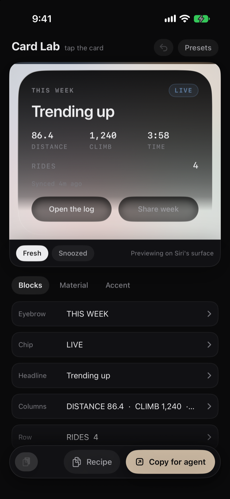
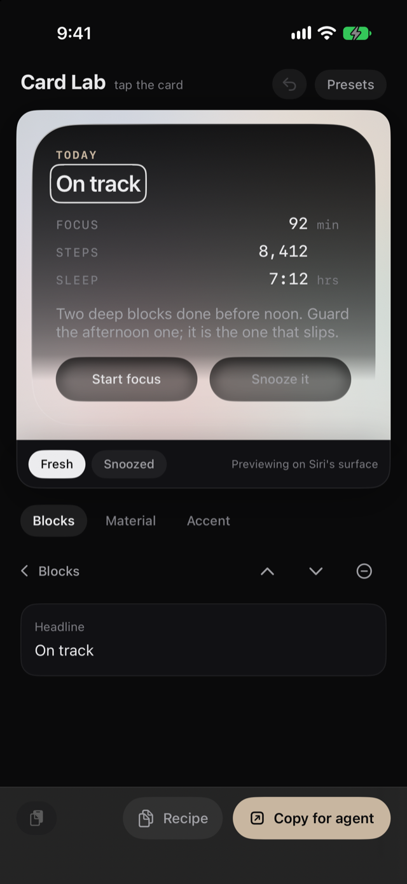
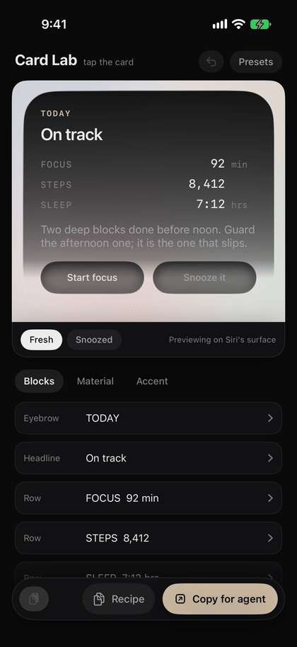

# SiriCardKit

Build a designed, interactive Siri card for your iOS app, with an AI agent
doing the typing.

  

iOS 26 gave apps interactive Siri snippets: real cards with live buttons
that Siri and Spotlight present when someone asks about your app. Apple's
documentation teaches the API. This kit teaches the part that is not
written down: how to make a card that looks designed, and the specific
failures that make cards silently not appear on real devices while the
simulator swears everything is fine.

Everything in here was extracted from a production app and verified on
device.

## How it works: design in the thing

The demo app is the design tool. Run it and your card sits at the top
of the screen, on the same light background Siri actually uses. Tap
anything on the card to change it: the headline, a row, a button. Add
what you want from the row beneath. The lab enforces the rules that
make these cards work on a real device, so you get one headline, four
rows at most, and the buttons stay at the bottom. There's undo.

The card has two looks. Dark ink, which you can tint toward a brand
color, or glass, where the card goes clear and the text flips dark so
it holds up on Siri's light sheet. Pick an ink or accent that's too
bright and the lab pulls it down until the words still read.

Every change saves as a **recipe**, and the demo's own Siri intent
reads that recipe. So put the lab down, say "Daily brief in Card Kit",
and Siri shows the card you just made. You haven't written any code
yet.

  
  &nbsp;&nbsp;
  

When the design settles, **Copy recipe** puts it on the pasteboard as
plain text. That text is the handshake: paste it back into the lab to
restore a design, or paste it to Claude Code, Codex, or Cursor with the
prompt in `PROMPTS.md`, and the agent builds the card into your own app
with your exact numbers and words.

## What's in the box

- `Sources/CardKit/CardLab.swift` - the design tool: the canvas, the
  material dials, the accent, the presets, Copy and Paste.
- `Sources/CardKit/CardRecipe.swift` - the recipe: an ordered list of
  blocks that carries a whole card, the composition laws as rails
  (`CardLaw`), and a tolerant text form for round-tripping through
  notes apps and agent chats.
- `Sources/CardKit/CardPresets.swift` - five archetypes (demo brief,
  stats, words-only, confirmation, glass) as whole recipes; their
  paste-in text forms live in `docs/PRESETS.md`.
- `Sources/CardKit/` - the card itself: the material (tinted ink that
  melts into the system's own glass, or the full-glass finish), the
  carved action wells, the metric row grammar, and the full intent trio
  (main intent, snippet intent, control intents) with every hard-won
  rule written next to the code it protects.
- `AGENTS.md` / `CLAUDE.md` - rules files that make agents build your
  card correctly the first time, including how to read a recipe.
- `.claude/skills/siri-card/` - the same rules as a portable Claude Code
  skill. Copy the folder into your own app repo's `.claude/skills/` and
  any Claude Code session there knows how to build your card.
- `PROMPTS.md` - the prompt to hand your agent along with your recipe.
  The lab's Copy for agent button writes it for you, recipe included.
- `docs/DEVICE-TRUTH.md` - the checklist that separates "renders in the
  sim" from "works in Siri on a phone".

## Quickstart

1. Clone this repo.
2. `brew install xcodegen` if you don't have it, then `xcodegen generate`
   and open `SiriCardKitDemo.xcodeproj`.
3. Run it. Start from a preset, then tap blocks on the card until the
   card is yours.
4. On a device, ask Siri: "Daily brief in Card Kit". That is your design
   in the real surface.
5. Tap **Copy for agent**. The full prompt lands on the pasteboard with
   your recipe inside; fill in the bracketed lines, paste it to Claude
   Code, Codex, or Cursor, and the agent builds the card into your own
   app. (Copy recipe grabs just the design.)
6. If your app repo uses Claude Code, copy `.claude/skills/siri-card/`
   into it so the rules travel with your project.

## The five failures this kit exists to prevent

1. **Glass kills the card.** `glassEffect` anywhere in a snippet makes
   real devices drop the entire card and show a bare dialog sheet. The
   simulator's fallback renderer hides this completely.
2. **The platter is milk.** Siri hosts cards on a light material. Dark
   designs that fade to clear drown their own text in it. The kit's
   material fades on a shaped curve that reaches zero only where no type
   lives.
3. **The system caches snippet renders across installs.** Ship a new card,
   see the old one. Restart the device to flush it before you conclude
   your build is broken.
4. **Phrases without the app name do not route.** Every App Shortcut
   phrase must contain `\(.applicationName)`.
5. **Dead buttons.** Only `Button(intent:)` and `Toggle(isOn:intent:)`
   are alive inside a snippet. Closures render and do nothing.

There are more rules than these five. They live in `AGENTS.md`, next to
the reasons.

## What this kit is not

It does not ship an app for you. The demo target exists to host the card
while you design; the card belongs inside your own app. Do not submit the
demo to the App Store: Apple's guidelines (4.2.6, 4.3a) treat
commercialized template apps as spam, and they are right to.

## Requirements

- iOS 26 or later (interactive snippets are an iOS 26 API)
- Xcode 26 or later
- A real device for final judgment. This is not optional; see
  `docs/DEVICE-TRUTH.md`.

## License

MIT. Take it, build with it, ship it in your app.
